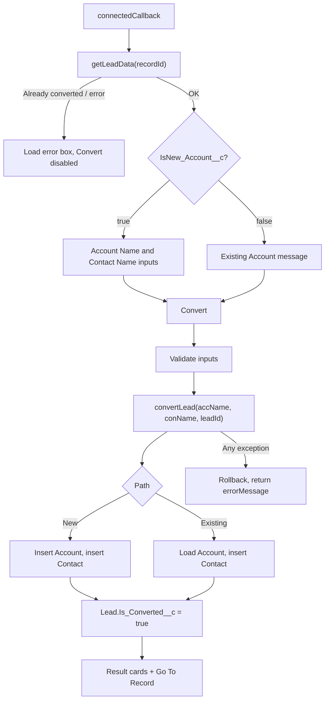

# Lead Conversion

A Lightning Web Component and Apex class that convert a record of the custom object `Lead__c` into an **Account** and a **Contact**. It replaces the standard Lead Convert for this org, because leads are stored in a custom object.

**API version (LWC):** 61.0

> Sample Request, Quote, pricebook and "Assigned to Dealer" logic from earlier versions is **commented out** in the Apex, LWC, HTML and tests. Only Account and Contact are created today.

---

## 1. What It Does

- Opens from a Lead record (it dispatches `closequickaction`, so it is used as a quick action).
- **New Account path:** shows an Account Name (prefilled from `Company__c`) and a Contact Name (prefilled from first and last name).
- **Existing Account path:** shows a message; a new Contact is created against the lead's existing Account and no Account is created.
- Shows a "Unable to Load Lead" box (and disables Convert) if the lead cannot be loaded, for example when it is already converted.
- After conversion, shows the Account and Contact details with **Close** and **Go To Record** (opens the Account).

---

## 2. Components

| Component | Type | Role |
|---|---|---|
| `leadConversion` | LWC (html, js, css, js-meta.xml) | Screen, validation, result display, navigation |
| `LeadConvertCls` | Apex (no sharing keyword) | Loads the lead, creates Account and Contact, marks the lead converted |
| `LeadConvertClsTest` | Apex test | 16 tests |
| `img` | Static resource | Image on the success screen |

Targets in the meta file: App Page, Home Page, Record Page, Record Action, Flow Screen.

---

## 3. How It Works



Per the test class, `IsNew_Account__c` (a formula on the lead) is true when `Existing_Account__c` points to a placeholder Account named **NEW**. The formula itself is not in the supplied files, so confirm it in the org.

---

## 4. Apex Reference

| Method | Used by LWC | Description |
|---|---|---|
| `getLeadData(String recId)` | Yes | Returns the lead; throws `AuraHandledException` if `Is_Converted__c` is true |
| `convertLead(String accName, String conName, Id leadId)` | Yes | Main conversion; returns `ConversionResult` |
| `getAccount(String accId, String leadId)` | No | Returns an Account (only referenced in commented-out LWC code) |
| `getContact(String contactId)` | No | Returns a Contact (only referenced in commented-out LWC code) |

`ConversionResult`: `accountId`, `contactId`, `errorMessage`, `isNewAccount`, `accountData`, `contactData`, `ownerName`.

**Error handling:** `convertLead` sets a savepoint. Any `DmlException` or other `Exception` rolls back everything and returns `errorMessage` rather than throwing. Validation messages raised inside the method (for example "already converted") also arrive this way.

**Duplicate rules:** Account and Contact are inserted with `DuplicateRuleHeader.AllowSave = true` and `OptAllOrNone = true`, so duplicate rules do not block conversion. Other DML failures still roll back.

### Lead__c to Account (new Account path)

| Lead__c | Account |
|---|---|
| `accName` (typed) | `Name` |
| `Phone__c`, `Email__c`, `Website__c` | `Phone`, `Email__c`, `Website` |
| `Customer_Classification__c`, `Dealer_Assigned__c`, `Division__c`, `OEM__c`, `New_OEM__c` | same names |
| `Type__c` | `Type` |
| `GST_Number__c` | `GST_Number__c`, `Shipping_GST_Number__c` |
| `PAN_Number__c` | `PAN_Number__c`, `Shipping_PAN_Number__c` |
| `CIN_Number__c` | `CIN_Number__c` |
| `Id` | `Lead_Name__c`, `LeadName__c` |
| `LeadSource__c`, `Subject__c` | `Lead_Source__c`, `Lead_Subject__c` |
| `Latest_Note__c`, `Note_Date__c` | same names |
| `CreatedById`, `CreatedDate` (date) | `Lead_Created_By__c`, `Lead_Creation_Date__c` |
| `Industry_Type__c`, `IndustryMulti__c`, `Industry_SubType__c` | same names |
| `No_of_Employees__c` | `NumberOfEmployees` |
| `Address1__c`, `City__c`, `State__c`, `Country__c`, `Zip_Postal_Code__c`, `Other_City__c` | `Billing_*` and `Shipping_*` custom address fields (including `Other_Billing_City__c` and `Other_Shipping_City__c`) |

### Lead__c to Contact (both paths)

`Title__c` to `Salutation`, `First_Name__c` / `Last_Name__c` to `FirstName` / `LastName`, `Designation__c` to `Title`, `Email__c` to `Email`, `Phone__c` to `Phone`, `Mobile__c` to `MobilePhone`, `Department__c` to `Department__c`, plus `AccountId`.

> The `conName` typed by the user is sent to Apex but **not used**. The Contact name always comes from the lead's first and last name.

---

## 5. LWC Reference

| Member | Description |
|---|---|
| `@api recordId` | The `Lead__c` Id |
| `connectedCallback` | Loads the lead; sets `accName`, `conName`, `existingAccountId`, `isNewAccountCheckbox`, `loadError` |
| `handleAcc` / `handleCon` | Store typed names |
| `handleClick` | Validates, calls `convertLead`, handles results and errors |
| `shouldShowAccountSection` | True when `IsNew_Account__c` is true |
| `isConvertDisabled` | True while converting or after a load error |
| `onclickGO` | Navigates to the Account |
| `handleCloseClick` / `handleCloseOppClick` | Dispatch `closequickaction` (the second also reloads the page) |

---

## 6. Data Dependencies

| Object | Notes |
|---|---|
| `Lead__c` | Name, Company__c, Lead_Status__c, contact fields (First_Name__c, Last_Name__c, Title__c, Designation__c, Department__c, Email__c, Phone__c, Mobile__c), `Existing_Account__c`, `IsNew_Account__c` (formula), `Is_Converted__c`, account-related fields, address fields |
| `Account` | Standard fields, the custom fields above, the custom Billing/Shipping address fields, `Applicable_Pricebook__c` (still queried) |
| `Contact` | Salutation, FirstName, LastName, Title, Email, Phone, MobilePhone, AccountId, `Department__c` |
| Static resource | `img` |

---

## 7. Tests

`LeadConvertClsTest` setup creates a placeholder Account named `NEW`, an existing Account with a Contact, a new-Account lead, an existing-Account lead and an already-converted lead.

Covered: lead load and already-converted, `getAccount`, `getContact`, new and existing Account conversion, Contact and address field mapping, already converted, null lead Id, missing existing Account, blank `Type__c`, result verification, and five single conversions with unique names.

The data uses org-specific values (for example `Dealer_Assigned__c` "Jai Balaji-Coimbatore", `New_OEM__c` "Bajaj Auto", `Type__c` "Local WB", Account `Status__c = Approved`), so update them for other orgs.

---

## 8. Deployment

1. Deploy the LWC bundle, `LeadConvertCls`, `LeadConvertClsTest` and the static resource `img`, with the `Lead__c`, `Account` and `Contact` fields above.
2. Make it available on Lead__c as a quick action or page component (the quick action is not in this repo).
3. Give users Apex class access to `LeadConvertCls`, create access to Account and Contact, edit access to `Lead__c`, and access to the fields used.
4. Run the tests.

```
sf project deploy start --source-dir force-app --target-org <alias> --test-level RunSpecifiedTests --tests LeadConvertClsTest
```

---

## 9. Known Issues and Ideas

- **Contact Name input has no effect:** Apex ignores `conName`.
- **Duplicates by design:** duplicate rules are bypassed, and the existing-Account path creates a new Contact every time.
- **No sharing keyword:** `LeadConvertCls` has no `with sharing` and no `WITH USER_MODE`; `getAccount` and `getContact` return data for any Id.
- **Dead code:** unused getters, LWC fields, CSS, and a lot of commented-out Sample/Quote/pricebook code in Apex, LWC, HTML and tests.
- **Logging:** many `System.debug` calls, and the LWC logs the whole lead to the browser console (personal data).
- **Conversion marker:** only `Is_Converted__c = true` is set; the status is unchanged and the lead does not store the new Account or Contact Ids. `Lead_Name__c` and `LeadName__c` on the Account are both set.
- **Not bulkified:** one lead per call (fine for the UI).
- **Pricebook field still needed:** `Applicable_Pricebook__c` is still queried.
